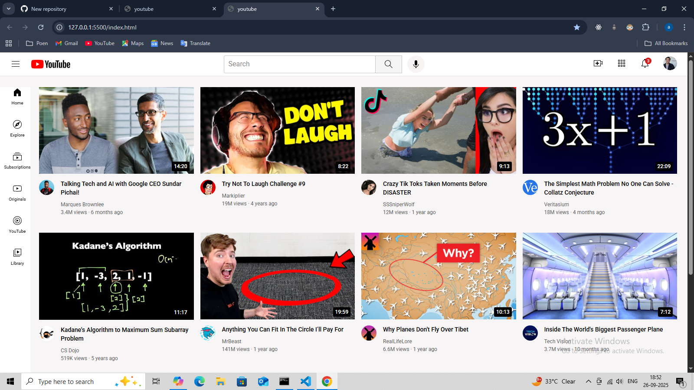

# 🎬 Responsive YouTube UI Clone

A fully responsive frontend clone of the YouTube homepage built using **HTML**, **CSS**, and **vanilla JavaScript**. Includes a **dark mode toggle**, **mobile-first design**, and clean layout inspired by the real YouTube interface.

---

## 📸 Screenshots

### 💻 Desktop View

### 📱 Mobile View

> *(Make sure your actual image filenames match these: `light-mode.png`, `dark-mode.png`, `mobile-view.png`)*

---

## 🚀 Features

- ✅ Responsive layout for mobile, tablet, and desktop
- ✅ Sidebar navigation with icons
- ✅ Video grid layout with thumbnails and titles
- ✅ Clean semantic HTML structure
- ✅ Organized CSS with modular files (`header.css`, `sidebar.css`, etc.)

---

## 📁 Folder Structure
